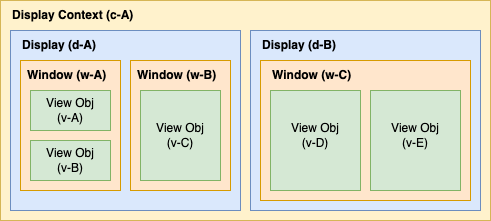

# @cisl/io-display

Module for `@cisl/io` that wraps the interface for the display-worker to make it easier to work with.

## Installation

```bash
npm install @cisl/io-display
```

## Usage

```javascript
import cislio from '@cisl/io';
import '@cisl/io-display';

const io = cislio();

(async function (): Promise<void> {
  const { displayContext } = await io.display.openDisplayWorker('contextOne', {
    main: {
      displayName: 'main',
      contentGrid: {
        row: 3,
        col: 3,
      },
    },
  });

  const promises = [];

  await io.display.displayUrl('main', 'http://www.google.com', {
    widthFactor: 1,
    heightFactor: 1,
  });

  await new Promise((resolve) => {
    setTimeout(resolve, 8000);
  });
  await displayContext.close();
})()
  .then(() => {
    console.log('done');
    process.exit();
  })
  .catch((err) => {
    console.error(err);
  });
```

You can see additional example usages of this module in the [display-worker/examples](https://github.com/bishopcais/display-worker/tree/master/examples) folder.

## Display Hierarchy

This module aims to enable the following hierarchy:

- There are some number of display contexts
- Within a display context, there is m displays (backed by display-worker per display)
- Within each display, there are n windows
- Within each window, there are o view objects

An example of the possibility of configuration is shown below:



Here, we have one display context that has two displays. In the display w-A, we have two windows w-A and w-B. In w-A, there are two view objects. In w-B, there is only one view object. In display d-B, there is one window that takes up the entire display. In this window w-C, there is two view objects. You may create multiple contexts, but only one context can be active at a time.
